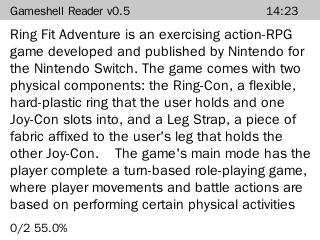
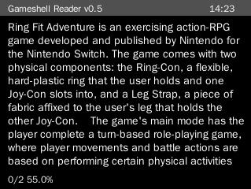
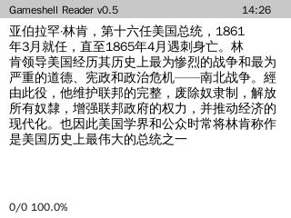

# GameshellReader
A simple txt reader for Gameshell that can save your progress and have night mode

## Screenshots

## Install
ssh into your gameshell and execute 

`apt-get build-dep python-pygame`

`sudo apt install libxml2 libxml2-dev libxslt1-dev`

`pip3 install pygame`

`cd ~`

`git clone https://github.com/LovelyA72/GameshellReader ~/apps/Menu/61_Reader`

`mkdir ~/ebook`
